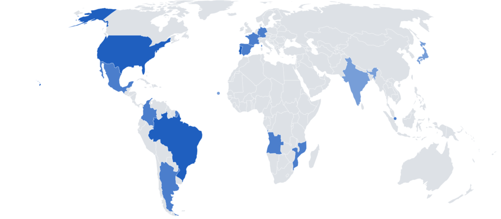
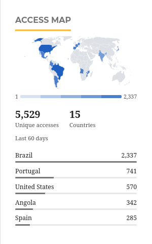

# Visitor Map — OJS plugin

[](https://pkp.sfu.ca/ojs/)
[](version.xml)
[](LICENSE)

**⬇️ Install package:** [OJS 3.5](https://github.com/OJSBR/visitorMap/releases/download/1.0.0.0/visitorMap-1.0.0.0.tar.gz) — or browse all [Releases](../../releases).

A sidebar block for **Open Journal Systems (OJS)** with a world map of where the accesses to the
journal come from, over the last days or since a date. It is drawn from the geographic usage
statistics OJS already keeps: **no tracking script, no third-party service, and the reader's
browser talks to no one but the journal.**

> **Developed and maintained by [OJSBR](https://ojsbr.com).** See the
> [Credits & authorship](#credits--authorship) section below.



## Compatibility & branches

| OJS version | Branch | Plugin release |
|-------------|--------|----------------|
| OJS 3.5.x   | [`stable-3_5_0`](../../tree/stable-3_5_0) *(default)* | 1.0.0.0 |

38 languages.

## The problem

Journals that want a "visitors map" usually paste a widget from mapmyvisitors, ClusterMaps,
RevolverMaps or Flag Counter. Every page view then sends the reader's IP address to a company
the reader never heard of, with no consent and no mention in any privacy policy. The tracking
code belongs to an account, not to a journal, so on a server with several journals the numbers
of one leak into the other. And all of it duplicates data OJS already collects.

## What it does



- A **choropleth world map**, one shade per country, on a logarithmic scale — the accesses of a
  journal are concentrated in a handful of countries, and a linear scale would leave the rest
  looking empty. Countries too small for the outlines (Singapore, Malta, Hong Kong, Cape Verde…)
  are shown as a dot.
- **The period is yours:** the last *N* days (up to yesterday, the last day with statistics), or
  everything since a date, or both — *the last 365 days, but never before the relaunch*.
- The **number of accesses and of countries**, and the **countries with the most accesses**, as
  text: screen readers and search engines get the data, not only a picture.
- **Unique accesses** (the same reader counted once per article and day) or all accesses.
- **Countries can be left out**, for accesses that are mostly data centres.
- Colours, title (per language) and the length of the list are set per journal.
- Managers see why the map is empty (geographic statistics off, no data yet, nothing in the
  period); readers see nothing instead of an empty box.

<br clear="right">

## Installation

1. Install via **Settings → Website → Plugins → Upload A New Plugin**, or extract the folder into
   `plugins/blocks/` so that you get `plugins/blocks/visitorMap/`. Do not rename the folder: OJS
   derives the plugin's class namespace from the directory name.
2. Enable **Visitor Map** in the *Block* plugins list. The plugin's tables are created and the
   first summing of the statistics is queued right away.
3. Add the block to the sidebar in **Settings → Website → Appearance → Setup → Sidebar**.

**Geographic statistics must be on.** In OJS 3.5 they are a site setting: **Administration → Site
Settings → Statistics → Geographical Statistics** (the country level is enough). Only accesses
recorded while it is on have a country.

## Configuration

In the plugin **Settings**:

| Setting | Default | |
|---|---|---|
| Number of days | 30 | The map covers the last *N* days, up to yesterday. 0 shows everything since the start date. |
| Start date | — | Accesses before this day are never counted. |
| What to count | Unique accesses | Or all accesses. |
| Countries to leave out | — | Two-letter codes, e.g. `SG, IE`. |
| Block title | *Access Map* | One per language of the journal. |
| Show the number of accesses and countries | on | |
| Countries listed below the map | 5 | 0 to 20. |
| Colours | grey / blue | Countries without accesses, and the strongest shade. |

**What the numbers are.** They are accesses recorded by the OJS usage statistics (COUNTER R5),
located by the address they came from. OJS already leaves out known robots, but a share of what
remains comes from data centres — it is the origin of the accesses, not a headcount of readers.
Unique accesses are less affected, which is why they are the default.

## How it works (technical)

- **Why not read the core table on every page.** `metrics_submission_geo_daily` has no index that
  serves a range of dates: on a journal with 5 million rows, summing 60 days takes 9 seconds. The
  plugin keeps its own small tables (`visitor_map_daily` — journal × country × day, indexed by
  journal and date; `visitor_map_monthly`; `visitor_map_state`) and the block reads only those.
- **How they are filled.** A queued job (`AggregateJob`) reads the core table **only through its
  indexes**: by `load_id` (one usage log file, one day) and by ranges of its primary key. Each day
  is recomputed as a whole and replaces what the plugin had, the way the core replaces a day it
  loads again. The last three days are always recomputed, because the core writes the unique
  accesses of a day in a second step. A day that did not change is not rewritten, so the caches
  built on the data survive. A job works for 15 seconds at most and queues the next one: the
  first filling of years of statistics takes a few jobs, then an update takes well under a second.
- **Months before the daily statistics.** Unless *keep daily usage statistics* is on, OJS deletes
  the daily data after two months and keeps only months. The months before the first day of daily
  data are taken once from `metrics_submission_geo_monthly`, read in chunks by primary key; a month
  counts when it lies wholly inside the period. From then on the plugin keeps its own daily
  history, which the core deletion does not touch.
- **When it runs.** Every hour through the task scheduler (`HasTaskScheduler`), when the plugin is
  enabled, and whenever a page finds the data more than six hours old. The core only registers the
  schedule of a journal-level plugin when the scheduler runs inside a request of that journal, so
  a page view is the second way in. A lock in the database keeps two runs from working at once.
- **Caching.** The block's figures are cached per journal, version of the data, period and
  settings. The map is written once to the journal's public folder as a static SVG named after its
  content (`public/journals/<id>/visitorMap-<hash>.svg`): the web server sends it with its own
  cache headers, the browser keeps it until the data changes, and the page itself only carries an
  `` loaded lazily. Measured on a journal page, the block adds about 2 ms; building a new map
  takes about 1 ms.
- **Robustness.** OJS draws every sidebar block inside a single hook, so an error in one block
  removes all the blocks after it. The block never throws: it logs the error and steps aside. Blocks
  are drawn after the page head, so the stylesheet is linked by the block's own template.
- **The outlines** come from [Natural Earth](https://www.naturalearthdata.com) 1:110m Admin 0 —
  Countries (public domain), projected with the Equal Earth projection and simplified by
  `tools/build-world.py` into `data/world.json` (62 KB, keyed by ISO 3166-1 alpha-2, the code OJS
  stores). Antarctica is left out. Kosovo is drawn under `XK`, the code the geolocation database
  uses.

## Privacy

The plugin stores no address and nothing about any reader: only *journal, country, day, number of
accesses*, summed from the statistics OJS already keeps. The map is served by the journal itself,
and the reader's browser makes no request to anyone else. If the core ever stops keeping daily
statistics, the plugin's summed history remains.

## Tests

- **PHPUnit** (`tests/*Test.php`, on `PKP\tests\PKPTestCase`): rows are written into the core
  tables the way the usage statistics loader writes them and **read back from the plugin's
  tables** — the first filling, a run with nothing new keeping the version, unique accesses
  written late, a day loaded again being replaced and not added, a new day, a run cut short
  resuming where it stopped, a second run waiting for the lock, and the period counting days and
  whole months; the block rendered through the template manager (the map file in the public
  folder, the numbers, the list, the cache between two views, a new file for new data, nothing
  for readers and the reason for managers); the outlines, the colour scale and the SVG; the
  settings; the classes against the installed PKP and the 38 translations. Counterproof: without
  the recomputing of the last days, without the comparison before rewriting, and without the
  cache, the matching tests fail. From the OJS root:

  ```bash
  lib/pkp/lib/vendor/bin/phpunit --configuration lib/pkp/tests/phpunit.xml --no-coverage "$PWD/plugins/blocks/visitorMap/tests"
  ```

- **Cypress** (`cypress/tests/functional/VisitorMap.cy.js`, run by
  [pkp-github-actions](https://github.com/pkp/pkp-github-actions) on every push): the manager puts
  the block in the sidebar through the appearance form, saves the settings and **reads them back
  from a form the server sends again** (an out-of-range value is refused); the reader sees the map
  on the home page, loaded lazily and drawn, with the numbers, the list and the chosen colour —
  or, where there are no geographic statistics, no block at all. Sidebar and settings are put back.
- Verified on OJS 3.5.0.3 with 57 days of daily and two months of monthly statistics, against
  totals computed independently; the queries were measured, read-only, on a journal with 5 million
  rows of daily statistics.

Tests, tools and screenshots are kept in the repository and are not part of the release package.

## Credits & authorship

- **Developed and maintained by** [OJSBR](https://ojsbr.com) — original plugin.
- Country outlines: **Made with [Natural Earth](https://www.naturalearthdata.com)**, public domain.
- Distributed under the **GNU GPL v3**.

## AI use

Generative AI (Claude, by Anthropic) was used to write and run tests, improve the code and bring
it in line with PKP standards. Every change is reviewed and tested by OJSBR, which is responsible
for the published releases.

## Contributing

Issues and pull requests are welcome. Please target the branch matching the OJS version you are
working against. See [`CONTRIBUTING.md`](CONTRIBUTING.md).

## License

Distributed under the **GNU GPL v3**. See [`LICENSE`](LICENSE) and `docs/COPYING`.

---

## 🇧🇷 Português

Bloco da barra lateral para o **Open Journal Systems (OJS)** com um mapa-múndi da origem dos
acessos à revista, nos últimos dias ou desde uma data. É desenhado a partir das estatísticas
geográficas de acesso que o OJS já guarda: **nenhum script de rastreamento, nenhum serviço de
terceiros, e o navegador do leitor não conversa com ninguém além da revista.**

> **Desenvolvido e mantido pela [OJSBR](https://ojsbr.com).** Veja a seção
> [Créditos e autoria](#créditos-e-autoria) abaixo.

### Compatibilidade e branches

| Versão do OJS | Branch | Release do plugin |
|---------------|--------|-------------------|
| OJS 3.5.x     | [`stable-3_5_0`](../../tree/stable-3_5_0) *(padrão)* | 1.0.0.0 |

38 idiomas.

### O problema

Revistas que querem um "mapa de visitantes" costumam colar um widget do mapmyvisitors, ClusterMaps,
RevolverMaps ou Flag Counter. A cada página vista, o IP do leitor vai para uma empresa que ele
nunca ouviu falar, sem consentimento e sem constar em política de privacidade nenhuma — exposição
desnecessária diante da LGPD. O código de rastreio é da conta, não da revista, e num servidor com
várias revistas os números de uma contaminam a outra. E tudo isso repete um dado que o OJS já coleta.

### O que faz

- **Mapa-múndi coroplético**, um tom por país, em escala logarítmica — os acessos de uma revista
  se concentram em poucos países, e numa escala linear o resto pareceria vazio. Países pequenos
  demais para os contornos (Singapura, Malta, Hong Kong, Cabo Verde…) aparecem como um ponto.
- **O período é seu:** os últimos *N* dias (até ontem, o último dia com estatística), ou tudo desde
  uma data, ou os dois — *os últimos 365 dias, mas nunca antes do relançamento*.
- O **número de acessos e de países** e os **países com mais acessos**, em texto: leitores de tela
  e buscadores recebem o dado, não só a figura.
- **Acessos únicos** (o mesmo leitor contado uma vez por artigo e por dia) ou todos os acessos.
- **Países podem ser deixados de fora**, para acessos que vêm sobretudo de data centers.
- Cores, título (por idioma) e tamanho da lista, por revista.
- O gerente vê por que o mapa está vazio (estatística geográfica desligada, sem dado ainda, nada no
  período); o leitor não vê nada, em vez de uma caixa vazia.

### Instalação

1. Instale por **Configurações → Website → Plugins → Enviar novo plugin**, ou extraia a pasta em
   `plugins/blocks/`, ficando `plugins/blocks/visitorMap/`. Não renomeie a pasta: o OJS deriva o
   namespace da classe do nome do diretório.
2. Ative **Mapa de Acessos** na lista de plugins de *Bloco*. As tabelas do plugin são criadas e a
   primeira soma das estatísticas entra na fila na hora.
3. Coloque o bloco na barra lateral em **Configurações → Website → Aparência → Configurar →
   Barra Lateral**.

**A estatística geográfica precisa estar ligada.** No OJS 3.5 ela é configuração do site:
**Administração → Configurações do Portal → Estatísticas → Estatísticas de uso geográfico** (o nível de
país basta). Só os acessos registrados com ela ligada têm país.

### Configuração

Nas **Configurações** do plugin:

| Opção | Padrão | |
|---|---|---|
| Número de dias | 30 | O mapa cobre os últimos *N* dias, até ontem. 0 mostra tudo desde a data inicial. |
| Data inicial | — | Acessos anteriores a este dia nunca entram na conta. |
| O que contar | Acessos únicos | Ou todos os acessos. |
| Países a deixar de fora | — | Códigos de duas letras, por exemplo `SG, IE`. |
| Título do bloco | *Mapa de acessos* | Um por idioma da revista. |
| Mostrar o número de acessos e de países | ligado | |
| Países listados abaixo do mapa | 5 | De 0 a 20. |
| Cores | cinza / azul | Países sem acessos e o tom mais forte. |

**O que os números são.** São acessos registrados pelas estatísticas de acesso do OJS (COUNTER R5),
localizados pelo endereço de origem. O OJS já descarta robôs conhecidos, mas parte do que sobra vem
de data centers — é a origem dos acessos, não uma contagem de leitores. Os acessos únicos sofrem
menos com isso, e por isso são o padrão.

### Como funciona (técnico)

- **Por que não ler a tabela do núcleo a cada página.** A `metrics_submission_geo_daily` não tem
  índice que sirva a um intervalo de datas: numa revista com 5 milhões de linhas, somar 60 dias
  leva 9 segundos. O plugin mantém tabelas próprias e pequenas (`visitor_map_daily` — revista ×
  país × dia, indexada por revista e data; `visitor_map_monthly`; `visitor_map_state`) e o bloco
  lê só delas.
- **Como são preenchidas.** Um job na fila (`AggregateJob`) lê a tabela do núcleo **só pelos
  índices**: por `load_id` (um arquivo de log, um dia) e por faixas da chave primária. Cada dia é
  recalculado inteiro e substitui o que o plugin tinha, do mesmo jeito que o núcleo substitui um dia
  que carrega de novo. Os três últimos dias são sempre recalculados, porque o núcleo grava os
  acessos únicos de um dia numa segunda etapa. Dia que não mudou não é regravado, e os caches
  continuam valendo. Cada job trabalha no máximo 15 segundos e agenda o seguinte: a primeira carga
  de anos de estatística leva alguns jobs; depois, uma atualização leva bem menos de um segundo.
- **Meses anteriores ao diário.** Se *manter as estatísticas diárias* estiver desligado, o OJS
  apaga o diário depois de dois meses e guarda só os meses. Os meses anteriores ao primeiro dia de
  dado diário vêm uma vez da `metrics_submission_geo_monthly`, lida em fatias pela chave primária;
  um mês conta quando está inteiro dentro do período. Daí em diante o plugin guarda o próprio
  histórico diário, que a limpeza do núcleo não alcança.
- **Quando roda.** A cada hora pelo agendador de tarefas (`HasTaskScheduler`), ao ligar o plugin, e
  sempre que uma página encontra o dado com mais de seis horas. O núcleo só registra o agendamento
  de plugin ligado por revista quando o agendador roda dentro de uma requisição daquela revista,
  por isso a visita à página é a segunda porta de entrada. Uma trava no banco impede duas rodadas
  ao mesmo tempo.
- **Cache.** Os números do bloco ficam em cache por revista, versão do dado, período e
  configuração. O mapa é gravado uma vez na pasta pública da revista como SVG estático, com nome
  tirado do próprio conteúdo (`public/journals/<id>/visitorMap-<hash>.svg`): o servidor web entrega
  com seus cabeçalhos de cache, o navegador guarda até o dado mudar, e a página só carrega um
  `` preguiçoso. Medido numa página da revista, o bloco acrescenta cerca de 2 ms; montar um
  mapa novo leva cerca de 1 ms.
- **Robustez.** O OJS desenha todos os blocos da barra lateral dentro de um único gancho, e um erro
  em um bloco some com todos os que vêm depois. Este bloco nunca lança erro: registra no log e se
  omite. Os blocos são desenhados depois do cabeçalho da página, por isso o próprio template do
  bloco liga a folha de estilo.
- **Os contornos** vêm do [Natural Earth](https://www.naturalearthdata.com) 1:110m Admin 0 —
  Countries (domínio público), projetados em Equal Earth e simplificados por
  `tools/build-world.py` em `data/world.json` (62 KB, por código ISO 3166-1 alfa-2, o código que o
  OJS grava). A Antártida fica de fora. O Kosovo é desenhado como `XK`, o código da base de
  geolocalização.

### Privacidade

O plugin não guarda endereço nem nada sobre leitor nenhum: só *revista, país, dia e número de
acessos*, somados a partir das estatísticas que o OJS já guarda. O mapa é servido pela própria
revista, e o navegador do leitor não faz requisição a mais ninguém. Se o núcleo deixar de guardar
as estatísticas diárias, o histórico somado do plugin continua.

### Testes

- **PHPUnit** (`tests/*Test.php`, sobre `PKP\tests\PKPTestCase`): linhas gravadas nas tabelas do
  núcleo do jeito que o carregador de estatísticas grava e **lidas de volta nas tabelas do plugin**
  — a primeira carga, uma rodada sem novidade mantendo a versão, acessos únicos gravados depois, um
  dia recarregado sendo substituído e não somado, um dia novo, uma rodada interrompida retomando de
  onde parou, uma segunda rodada esperando a trava, e o período contando dias e meses inteiros; o
  bloco renderizado pelo gerenciador de templates (o arquivo do mapa na pasta pública, os números, a
  lista, o cache entre duas visitas, arquivo novo para dado novo, nada para o leitor e o motivo para
  o gerente); os contornos, a escala de cores e o SVG; as configurações; as classes contra o PKP
  instalado e os 38 idiomas. Contraprova: sem recalcular os últimos dias, sem comparar antes de
  regravar e sem o cache, os testes correspondentes reprovam.
- **Cypress** (`cypress/tests/functional/VisitorMap.cy.js`): o gerente põe o bloco na barra lateral
  pelo formulário de aparência, salva as configurações e **as lê de volta num formulário que o
  servidor manda de novo** (valor fora da faixa é recusado); o leitor vê o mapa na página inicial,
  carregado sob demanda e desenhado, com os números, a lista e a cor escolhida — ou, onde não há
  estatística geográfica, nenhum bloco. Barra lateral e configurações voltam ao que eram.
- Conferido no OJS 3.5.0.3 com 57 dias de estatística diária e dois meses de mensal, contra totais
  calculados de forma independente; as consultas foram medidas, só em leitura, numa revista com 5
  milhões de linhas de estatística diária.

### Créditos e autoria

- **Desenvolvido e mantido pela** [OJSBR](https://ojsbr.com) — plugin original.
- Contornos dos países: **feito com [Natural Earth](https://www.naturalearthdata.com)**, domínio
  público.
- Distribuído sob a **GNU GPL v3**.

### Uso de IA

Foi usada IA generativa (Claude, da Anthropic) para escrever e rodar testes, melhorar o código e
alinhá-lo aos padrões da PKP. Toda mudança é revisada e testada pela OJSBR, que responde pelas
releases publicadas.

### Licença

Distribuído sob a **GNU GPL v3**. Veja [`LICENSE`](LICENSE) e `docs/COPYING`.
